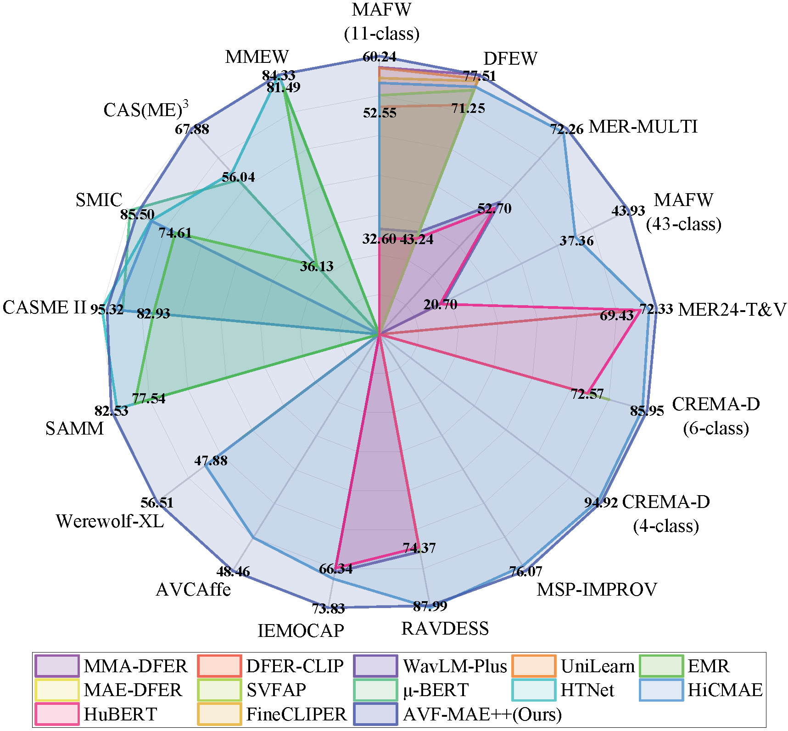
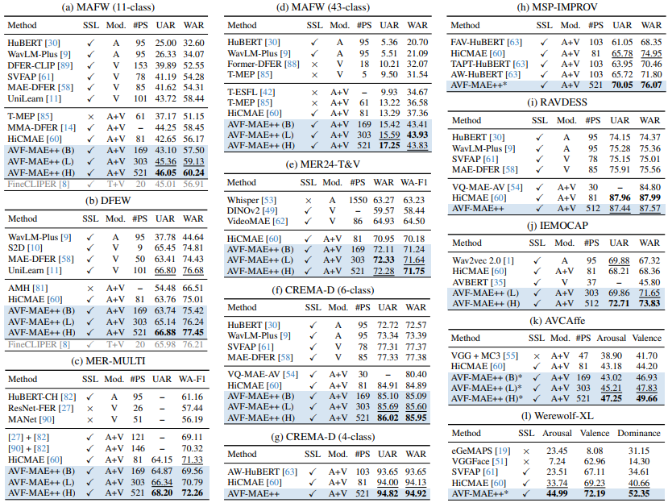
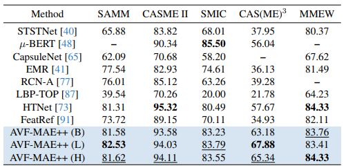

<p align="center">
    
<p>
<h1 align="center">AVF-MAE++ : Scaling Affective Video Facial Masked Autoencoders via Efficient Audio-Visual Self-Supervised Learning</h1>
<p align="center">
  <a href='https://openaccess.thecvf.com/content/CVPR2025/papers/Wu_AVF-MAE_Scaling_Affective_Video_Facial_Masked_Autoencoders_via_Efficient_Audio-Visual_CVPR_2025_paper.pdf'></a>
  <a href='https://huggingface.co/Conna/AVF-MAE'></a>

> [Xuecheng Wu](https://scholar.google.com.hk/citations?user=MuTEp7sAAAAJ), [Heli Sun](https://scholar.google.com.hk/citations?user=HXjwuE4AAAAJ), Yifan Wang, Jiayu Nie, [Jie Zhang](https://scholar.google.com.hk/citations?user=7YkR3CoAAAAJ), [Yabing Wang](https://scholar.google.com.hk/citations?user=3WVFdMUAAAAJ), [Junxiao Xue](https://scholar.google.com.hk/citations?user=Za9YFVIAAAAJ), Liang He<br>
> Xi'an Jiaotong University & University of Science and Technology of China & A*STAR & Zhejiang Lab<br>


## 🌟 Overview


**Abstract: Affective Video Facial Analysis (AVFA) is important for advancing emotion-aware AI, yet the persistent data scarcity in AVFA presents challenges. Recently, the self-supervised learning (SSL) technique of Masked Autoencoders (MAE) has gained significant attention, particularly in its audio-visual adaptation. Insights from general domains suggest that scaling is vital for unlocking impressive improvements, though its effects on AVFA remain largely unexplored. Additionally, capturing both intra- and inter-modal correlations through scalable representations is a crucial challenge in this field. To tackle these gaps, we introduce AVF-MAE++, a series audio-visual MAE designed to explore the impact of scaling on AVFA with a focus on advanced correlation modeling. Our method incorporates a novel audio-visual dual masking strategy and an improved modality encoder with a holistic view to better support scalable pre-training. Furthermore, we propose the Iteratively Audio-Visual Correlations Learning Module to improve correlations capture within the SSL framework, bridging the limitations of prior methods. To support smooth adaptation and mitigate overfitting, we also introduce a progressive semantics injection strategy, which structures training in three stages. Extensive experiments across 17 datasets, spanning three key AVFA tasks, demonstrate the superior performance of AVF-MAE++, establishing new state-of-the-art outcomes. Ablation studies provide further insights into the critical design choices driving these gains.**


## 🛫 Main Results

<p align="center">
   <br>
   Performance comparisons of AVF-MAE++ and state-of-the-art AVFA methods on 17 datasets across CEA, DEA, and MER tasks.
</p>


<p align="center">
   <br>
   Performance comparisons of AVF-MAE++ with state-of-the-art CEA and DEA methods on twelve datasets.
</p>


<p align="center">
   <br>
   Performance comparisons of AVF-MAE++ and state-ofthe-art MER methods in terms of UF1 (%) on five datasets
</p>


## 🌞 Visualizations

### 🌟 Audio-visual reconstructions


### 🌟 Confusion matrix on MAFW (11-class) dataset


## 🔨 Installation and Data Preparation

**Regarding this part, please refer to [HiCMAE](https://github.com/sunlicai/HiCMAE) for the detailed reference.**


## 🚀 Pre-train HiCMAE

- Mix-hybrid-data

    ```
    bash scripts/audio_visual/huge/pretrain/pretrain-huge-mix-data.sh
    ```

## 🚗 Fine-tuning with pre-trained models
**TBD**


<!-- TODO List -->
## 🚧 TODO List
- [x] Release pretraining code
- [ ] Release hybrid intermediate and targeted fine-tuning code
- [ ] Infill the detailed README

**Too busy these days, our TODO list will be tackled soon.**


## 👍 Acknowledgements

This project is built upon [HiCMAE](https://github.com/sunlicai/HiCMAE), [MAE-DFER](https://github.com/sunlicai/MAE-DFER), [VideoMAE](https://github.com/MCG-NJU/VideoMAE), and [AudioMAE](https://github.com/facebookresearch/AudioMAE). Thanks for their insightful and great codebase.


## ✏️ Citation
**If you find this paper useful in your research, please consider citing:**

```
@InProceedings{Wu_2025_CVPR,
    author    = {Wu, Xuecheng and Sun, Heli and Wang, Yifan and Nie, Jiayu and Zhang, Jie and Wang, Yabing and Xue, Junxiao and He, Liang},
    title     = {AVF-MAE++: Scaling Affective Video Facial Masked Autoencoders via Efficient Audio-Visual Self-Supervised Learning},
    booktitle = {Proceedings of the Computer Vision and Pattern Recognition Conference (CVPR)},
    month     = {June},
    year      = {2025},
    pages     = {9142-9153}
}
```

**You can also consider citing the following related papers:**

```
@article{sun2024hicmae,
  title={Hicmae: Hierarchical contrastive masked autoencoder for self-supervised audio-visual emotion recognition},
  author={Sun, Licai and Lian, Zheng and Liu, Bin and Tao, Jianhua},
  journal={Information Fusion},
  volume={108},
  pages={102382},
  year={2024},
  publisher={Elsevier}
}
```

```
@inproceedings{sun2023mae,
  title={Mae-dfer: Efficient masked autoencoder for self-supervised dynamic facial expression recognition},
  author={Sun, Licai and Lian, Zheng and Liu, Bin and Tao, Jianhua},
  booktitle={Proceedings of the 31st ACM International Conference on Multimedia},
  pages={6110--6121},
  year={2023}
}
```

```
@article{sun2024svfap,
  title={SVFAP: Self-supervised video facial affect perceiver},
  author={Sun, Licai and Lian, Zheng and Wang, Kexin and He, Yu and Xu, Mingyu and Sun, Haiyang and Liu, Bin and Tao, Jianhua},
  journal={IEEE Transactions on Affective Computing},
  year={2024},
  publisher={IEEE}
}
```
