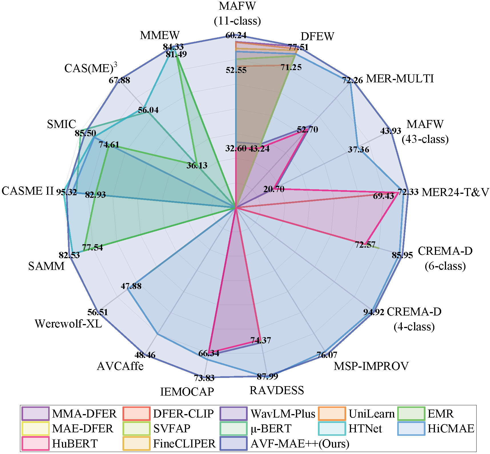
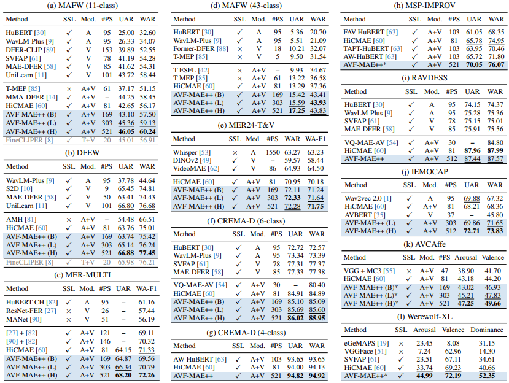
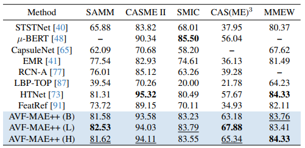

<p align="center">
  <br>
</p>

<h1 align="center">AVF-MAE++: Scaling Affective Video Facial Masked Autoencoders via Efficient Audio-Visual Self-Supervised Learning</h1>

<p align="center">
  <a href="https://openaccess.thecvf.com/content/CVPR2025/papers/Wu_AVF-MAE_Scaling_Affective_Video_Facial_Masked_Autoencoders_via_Efficient_Audio-Visual_CVPR_2025_paper.pdf"></a>
  <a href="https://huggingface.co/Conna/AVF-MAE"></a>
  
</p>

<p align="center">
  Xuecheng Wu, Heli Sun, Yifan Wang, Jiayu Nie, Jie Zhang, Yabing Wang, Junxiao Xue, Liang He
</p>

<p align="center">
  Xi'an Jiaotong University · University of Science and Technology of China · A*STAR · Zhejiang Lab
</p>

## Overview

AVF-MAE++ is an audio-visual self-supervised learning framework for affective video facial analysis. It scales masked autoencoding to affective facial video representation learning and improves audio-visual correlation modeling through dual masking, local-global attention, and progressive semantic injection.

<p align="center">
  
</p>

The repository contains the training, pretraining, fine-tuning, evaluation, preprocessing, and experiment script code used for AVF-MAE++.

## Main Results

<p align="center">
  <br>
  Performance comparisons on 17 datasets across CEA, DEA, and MER tasks.
</p>

<p align="center">
  <br>
  Comparison with state-of-the-art CEA and DEA methods.
</p>

<p align="center">
  <br>
  Comparison with state-of-the-art MER methods in terms of UF1.
</p>

## Repository Structure

```text
.
├── run_mae_pretraining_av.py        # audio-visual masked autoencoder pretraining
├── run_class_finetuning_av.py       # fine-tuning and evaluation
├── modeling_pretrain_av.py          # pretraining architecture
├── modeling_finetune_av.py          # fine-tuning architecture
├── modeling_attention_av.py         # attention and fusion blocks
├── engine_for_pretraining_av.py     # pretraining loop
├── engine_for_finetuning_av.py      # fine-tuning/evaluation loop
├── datasets_av.py                   # dataset factory
├── kinetics_av.py                   # video/audio dataset implementation
├── preprocess/                      # dataset list generation and preprocessing utilities
└── scripts/                         # example pretraining, fine-tuning, and evaluation scripts
```

## Installation

Create a Python environment and install dependencies:

```bash
conda create -n avfmaepp python=3.8 -y
conda activate avfmaepp
pip install -r requirements.txt
```

Install a PyTorch build that matches your CUDA environment. Some data preprocessing utilities require external tools such as `ffmpeg` and OpenFace.

## Data Preparation

Datasets and generated split files are not included in this repository. The training scripts expect preprocessed audio-visual list files under local paths such as:

```text
saved/data/<dataset>/audio_visual/.../*.csv
datasets/<dataset>/...
```

Each row in a generated split file should point to visual frames, audio files, and labels according to the dataset loader used by `datasets_av.py` and `kinetics_av.py`.

The `preprocess/` directory provides scripts for generating these audio-visual list files for supported datasets. Review dataset paths before running them on a new machine.

## Pretraining

Example single-node pretraining command:

```bash
python -m torch.distributed.launch --nproc_per_node=1 run_mae_pretraining_av.py \
  --model pretrain_hicmae_dim512_patch16_160_a256 \
  --data_path saved/data/mix-data/audio_visual/pretrain.csv \
  --output_dir saved/model/avfmaepp_pretrain \
  --log_dir saved/model/avfmaepp_pretrain \
  --batch_size 32 \
  --epochs 100 \
  --input_size 160 \
  --input_size_audio 256 \
  --mask_ratio 0.75 \
  --mask_ratio_audio 0.8
```

## Fine-tuning and Evaluation

Example fine-tuning command on an affective video dataset:

```bash
python -m torch.distributed.launch --nproc_per_node=1 run_class_finetuning_av.py \
  --model avit_dim768_patch16_160_a256 \
  --data_set MAFW \
  --nb_classes 11 \
  --data_path saved/data/MAFW/audio_visual/single/split01 \
  --finetune /path/to/pretrained_checkpoint.pth \
  --output_dir saved/model/avfmaepp_finetune \
  --log_dir saved/model/avfmaepp_finetune \
  --batch_size 8 \
  --epochs 100 \
  --input_size 160 \
  --input_size_audio 256
```

The `scripts/` directory contains additional experiment templates for different model scales, pretraining data mixtures, and downstream datasets. Before running a script, check the following variables:

- `DATA_PATH`
- `OUTPUT_DIR`
- `CHECKPOINT`
- `CUDA_VISIBLE_DEVICES`

## Model Weights

Pretrained models are hosted on HuggingFace:

https://huggingface.co/Conna/AVF-MAE

Weights and checkpoints are intentionally not committed to this repository.

## Notes

- Dataset files, generated CSV files, checkpoints, logs, and evaluation outputs are ignored by git.
- The codebase is designed for CUDA-based distributed training.
- The example commands are templates; adapt paths and hyperparameters to your local environment.

## Acknowledgements

This project builds on ideas and code from HiCMAE, MAE-DFER, VideoMAE, AudioMAE, and timm. We thank the authors for their open-source contributions.

## Citation

If this repository is useful for your research, please cite:

```bibtex
@InProceedings{Wu_2025_CVPR,
    author    = {Wu, Xuecheng and Sun, Heli and Wang, Yifan and Nie, Jiayu and Zhang, Jie and Wang, Yabing and Xue, Junxiao and He, Liang},
    title     = {AVF-MAE++: Scaling Affective Video Facial Masked Autoencoders via Efficient Audio-Visual Self-Supervised Learning},
    booktitle = {Proceedings of the Computer Vision and Pattern Recognition Conference (CVPR)},
    month     = {June},
    year      = {2025},
    pages     = {9142--9153}
}
```

Related work:

```bibtex
@article{sun2024hicmae,
  title={HiCMAE: Hierarchical Contrastive Masked Autoencoder for Self-Supervised Audio-Visual Emotion Recognition},
  author={Sun, Licai and Lian, Zheng and Liu, Bin and Tao, Jianhua},
  journal={Information Fusion},
  volume={108},
  pages={102382},
  year={2024},
  publisher={Elsevier}
}
```

```bibtex
@inproceedings{sun2023mae,
  title={MAE-DFER: Efficient Masked Autoencoder for Self-Supervised Dynamic Facial Expression Recognition},
  author={Sun, Licai and Lian, Zheng and Liu, Bin and Tao, Jianhua},
  booktitle={Proceedings of the 31st ACM International Conference on Multimedia},
  pages={6110--6121},
  year={2023}
}
```
